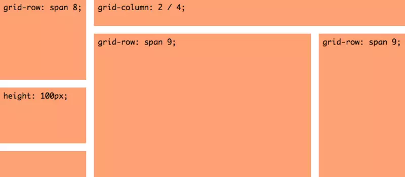
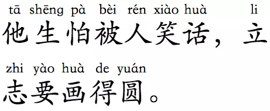

从大的分类来讲， display的写法可以分为 6个大类，再加上 1个全局类，一共是 7大类：

- 外部值
- 内部值
- 列表值
- 属性值
- 显示值
- 混合值
- 全局值

### 外部值

所谓外部值，就是说这些值只会直接影响一个元素的外部表现，而不影响元素里面的儿子级孙子级元素的表现。

#### display: block;

我们最熟悉的

缺省就是这个值，最基本的块级元素，属于 css入门初学者都知道的概念，只要是容器类型的元素基本都是这个值。

<!--more-->

#### display: inline;

行内元素，只要是个行内元素都是这个值。

#### display: run-in;

这个值有点奇怪，通常没人用它，但你可以知道它。因为除了 IE和 Opera支持它以外，其他所有主流浏览器包括 Chrome, Safari, Firefox全都对它置若罔闻。这东西说白了也没什么神秘，它的意思就是说如果我们命令一个元素 run-in，中文意思就是『 闯入』！那么这个元素就直接闯入下一行。

写起来大概就是这样：

```
<div class="a">aaa</div>
<div class="b">bbb</div>
.a {
  font-size: 36px;
  display: run-in;
}
```


### 内部值

内部值主要是用来管束自己下属的儿子级元素的排布的，规定它们或者排成 S形，或者排成 B形这样的。

#### display: flow;

含义不清，实验室阶段产品， Chrome不支持。如果还不够说服你暂时不要碰它的话，试着理解以下英文原文：

> If its outer display type is inline or run-in, and it is participating in a block or inline formatting context, then it generates an inline box. Otherwise it generates a block container box.

#### display: flow-root;

不同于刚才谈到的 flow，现在用 flow-root的渐渐多起来了，因为它可以撑起被你 float掉的块级元素的高度。

#### display: table;

这一个属性，以及下面的另外 8个与 table相关的属性，都是用来控制如何把 div显示成 table样式的，因为我们不喜欢

这个标签嘛，所以我们想把所有的

标签都换成

标签。


#### display: flex;

display:flex;以及与它相关联的一系列属性： flex-direction, flex-wrap, flex-flow, justify-content, align-items, align-content，并且包括所有这些属性的取值，都是你需要反复研磨的。 2009年诞生的这个属性可以说是不亚于 css界一场蒸汽机诞生一样的工业革命，它的诞生标志着马车一样的 float被彻底抛进历史的垃圾堆。

#### display: grid




grid布局，中文翻译为 网格布局。学习 grid布局有两个重点：一个重点是 grid布局引入了一个全新的单位： fr，它是 fraction（ 分数）的缩写，所以从此以后，你的兵器库里除了 px, em, rem, 百分比这些常见兵器以及 vw, vh这些新式武器之外，又多了一样旁门暗器 fr，要想用好 grid，必须充分掌握 fr。另一个重点是 斜杠操作符，这可不是 分数哦。它表示的是 起始位置和 结束位置。比如说 3/4，这可不是 四分之三的意思，这是指一个元素从第 3行开始，到第 4行结束，但又不包括第 4行。

#### display: ruby;

ruby这个取值对于我们亚洲人来说其实是非常有用的一个东西，但是目前除了 Firefox以外其它浏览器对它的支持都不太好。简而言之， display:ruby;的作用就是可以做出下面这样的东西：



#### display: subgrid;

subgrid总的思想是说大网格里还可以套小网格，互相不影响。

### 列表值

#### display: list-item;

display:list-item;和 display:table;一样。用 ul li能实现的效果，他可以用 div实现出来，就是这个作用。

### 属性值

属性值一般是附属于主值的，比如主值里设置了 display:table;，就可以在子元素里使用 display:table-row-group;等等属性，不过并不绝对。关于它们的作用，主要参考主值就够了。

#### display: table-row-group;

详情参考display: tabl;。

#### display: table-header-group;

详情参考display: table。

#### display: table-footer-group;

详情参考display: table。

#### display: table-row;

详情参考display: table。

#### display: table-cell;

详情参考display: table;这个属性有必要详细说说，因为它完全可以单独应用，用在高度不固定元素的垂直居中上。

#### display: table-column-group;

详情参考display: table。

#### display: table-column;

详情参考display: table。

#### display: table-caption;

详情参考display: table。

#### display: ruby-base;

详情参考display: ruby。

#### display: ruby-text;

详情参考display: ruby。

#### display: ruby-base-container;

详情参考display: ruby。

#### display: ruby-text-container;

详情参考display: ruby。

### 显示值

MDN里把它叫做《 display-box 》 values（ 盒子值），我把它叫做 显示值，主要是为了便于理解。

#### display: contents;

display:contents的作用：它让子元素拥有和父元素一样的布局方式，仅此而已。

#### display: none;

### 混合值

#### display: inline-block;

#### display: inline-table;

#### display: inline-flex;

### 全局值

这些值不是 display属性的专利，几乎其它任意属性都可以用，列在这里凑个数。

#### display: inherit;

继承父元素的 display属性。

#### display: initial;

不管父元素怎么设定，恢复到浏览器最初始时的 display属性。

#### display: unset;

unset混合了 inherit和 initial。如果父元素设值了，就用父元素的设定，如果父元素没设值，就用浏览器的缺省设定。