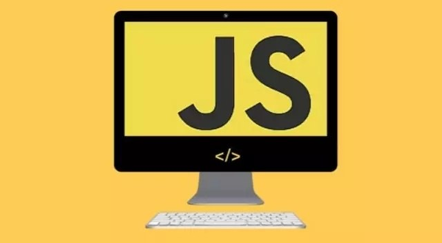

关于模块化，最直接的表现就是我们写的 require 和 import 关键字，如果查阅相关资料，就一定会遇到 CommonJS 、CMD AMD 这些名词，以及 RequireJS、SeaJS 等陌生框架。比如 SeaJS 的官网 这样描述自己: “简单友好的模块定义规范，Sea.js 遵循 CMD 规范。自然直观的代码组织方式，依赖的自动加载……”
　




<!--more-->

### JavaScript 基础

　　做客户端的同学对 OC 的 #import “classname”、Swift 的 Module 以及文件修饰符 和 Java 的 import package+class 模式应该都不陌生。我们习惯了引用一个文件就是引用一个类的模式。然而在 JavaScript 这种动态语言中，事情又有一些变化，举个例子说明:

``` bash
<html>

<head>
</head>
<body>

<p id="hello"> Hello Wrold </p>
<input type="button" onclick="onPress()" value="Click me" />
</body>
</html>
// index.js
function onPress() {
var p = document.getElementById('hello');
p.innerHTML = 'Hello bestswifter';
}
　　HTML 中的 </head> <body> <p id="hello"> Hello Wrold </p> <input type="button" onclick="onPress()" value="Click me" /> </body> </html>
// index.js
function onPress() {
var p = document.getElementById('hello');
p.innerHTML = add(1, 2);
}
```
　　可以看到这种写法并不优雅， index.js 对别的 JS 文件中的内容并没有控制权，能否调用到 add 方法完全取决于使用自己的 HTML 文件有没有正确引用别的 JS 文件。


### 初步模块化
　　刚刚所说的痛点其实可以分为两种:（1） index.js 无法 import，依赖于 HTML 的引用;（2）index.js 中无法对 add 方法的来源做区分，缺少命名空间的概念。
　　第一个问题留在后面解答，我们先着手解决第二个问题，比如先把函数放到一个对象中，这样我们可以暴露一个对象，让使用者调用这个对象的多个方法:
``` bash
//index.js
function onPress() {
var p = document.getElementById('hello');
p.innerHTML = math.add(1, 2);
}
//math.js
var math = {
base: 0,
add: function(a, b) {
return a + b + base;
},
};
```
　　可以看到在 index.js 中已经可以指定一个简易版的命名空间了(也就是 math)。但目前还有一个小问题，比如 base 这个属性会被暴露给外界，也可以被修改。所以更好的方式是将 math 定义在一个闭包里，从而隐藏内部属性:

``` bash
// math.js
var math = (function() {
var base = 0;
return {
add: function(a, b) {
return a + b + base;
},
};
})();
```
　　到目前为止，我们实现了模块的定义和使用。不过模块化的一大精髓在于命名空间，也就是说我们希望自己的 math 模块不是全局的，而是按需导入，这样一来，即使多个文件暴露同名对象也不会出问题。就像 node.js 中那样，需要暴露的模块定义自己的 export 内容，然后调用方使用 require 方法。
　　其实可以简单模拟一下 node.js 的工作方式，通过增加一个中间层来解决: 首先定义一个全局变量:

``` bash
// global.js
var module = {
exports: {}, // 用来存储所有暴露的内容
};
　　//然后在 math.js 中暴露对象:
var math = (function() {
var base = 0;
return {
add: function(a, b) {
return a + b + base;
},
};
})();
module.exports.math = math;
　　//使用者 index.js 现在应该是:
var math = module.exports.math;
function onPress() {
var p = document.getElementById('hello');
// math
p.innerHTML = math.add(1, 2);
}
```
### 现有模块化方案
　　上述简单的模块化方式有一些小问题。首先，index.js 必须严格依赖于 math.js 执行，因为只有 math.js 执行完才会向全局的 module.export 中注册自己。这就要求开发者必须手动管理 js 文件的加载顺序。随着项目越来越大，依赖的维护会变得越来越复杂。
　　其次，由于加载 JS 文件时，浏览器会停止渲染网页，因此我们还需要 JS 文件的异步按需加载。
　　最后一个问题是，之前给出的简化版模块化方案并没有解决模块的命名空间，相同的导出依旧会替换掉之前的内容，而解决方案则是维护一个 “文件路径 <–> 导出内容” 的表，并且根据文件路径加载。
　　基于上述需求，市场上出现了很多套模块化方案。为啥会有多套标准呢，实际上还是由前端的特性导致的。由于缺乏一个统一的标准，所以很多情况下大家做事的时候都是靠约定，就比如上述的 export 和 require。如果代码的提供者把导出内容存储在 module.exports 里，而使用者读取的是 module.export，那自然是徒劳的。不仅如此，各个规范的实现方式、使用场景也不尽相同。

### CommonJS
　　比较知名的规范有 CommonJS、AMD 和 CMD。而知名框架 Node.js、RequireJS 和 Seajs 分别实现了上述规范。
　　最早的规范是 CommonJS，Node.js 使用了这一规范。这一规范和我们之前的做法比较类似，是同步加载 JS 脚本。这么做在服务端毫无问题，因为文件都存在磁盘上，然而浏览器的特性决定了 JS 脚本需要异步加载，否则就会失去响应，因此 CommonJS 规范无法直接在浏览器中使用。

### AMD　
　　浏览器端著名的模块管理工具 Require.js 的做法是异步加载，通过 Webworker 的 importScripts(url); 函数加载 JS 脚本，然后执行当初注册的回调。Require.js 的写法是:

``` bash
require(['myModule1', 'myModule2'], function (m1, m2){
// 主回调逻辑
m1.printName();
m2.printName();
});
```

　　由于这两个模块是异步下载，因此哪个模块先被下载、执行并不确定，但可以肯定的是主回调一定在所有依赖都被加载完成后才执行。
　　Require.js 的这种写法也被称为前置加载，在写主逻辑之前必须指定所有的依赖，同时这些依赖也会立刻被异步加载。
　　由 Require.js 引申出来的规范被称为 AMD(Asynchronous Module Definition)。

### CMD
　　另一种优秀的模块管理工具是 Sea.js，它的写法是:

``` bash
define(function(require, exports, module) {
var foo = require('foo'); // 同步
foo.add(1, 2);
...
require.async('math', function(math) { // 异步
math.add(1, 2);
});
});
```
　　Sea.js 也被称为就近加载，从它的写法上可以很明显的看到和 Require.js 的不同。我们可以在需要用到依赖的时候才申明。
　　Sea.js 遇到依赖后只会去下载 JS 文件，并不会执行，而是等到所有被依赖的 JS 脚本都下载完以后，才从头开始执行主逻辑。因此被依赖模块的执行顺序和书写顺序完全一致。
　　由 Sea.js 引申出来的规范被称为 CMD(Common Module Definition)。

### ES6 模块化
　　在 ES6 中，我们使用 export 关键字来导出模块，使用 import 关键字引用模块。需要说明的是，ES 6 的这套标准和目前的标准没有直接关系，目前也很少有 JS 引擎能直接支持。因此 Babel 的做法实际上是将不被支持的 import 翻译成目前已被支持的 require。
　　尽管目前使用 import 和 require 的区别不大(本质上是一回事)，但依然强烈推荐使用 import 关键字，因为一旦 JS 引擎能够解析 ES 6 的 import 关键字，整个实现方式就会和目前发生比较大的变化。如果目前就开始使用 import 关键字，将来代码的改动会非常小。